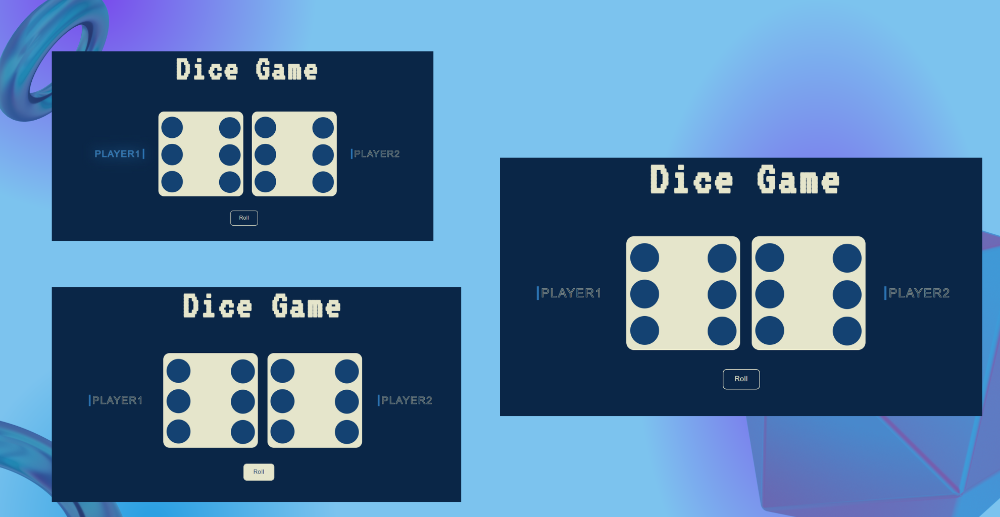

# DiceGame

This is a simple game done with html, css and javascript.
The goal is to do higher points than computer.  
Choose your dice and try your luck!

## Preview

+ Live [preview](https://davidebran.github.io/DiceGame/)

## tecnologies 

+ 
+ 
+ 

## what i learned 

+ Usage of Javascript for update page
+ Traingin with css for desktop layout 
